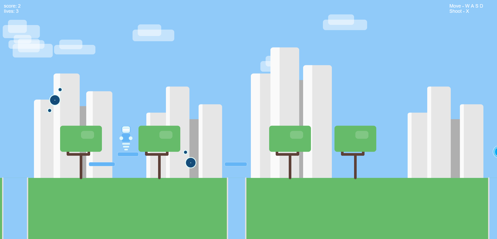
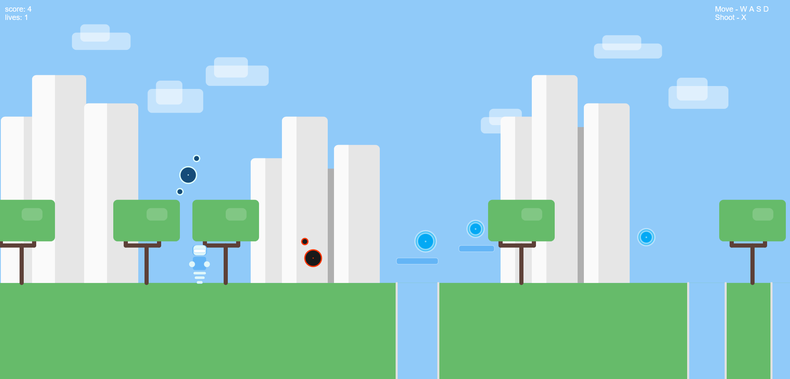
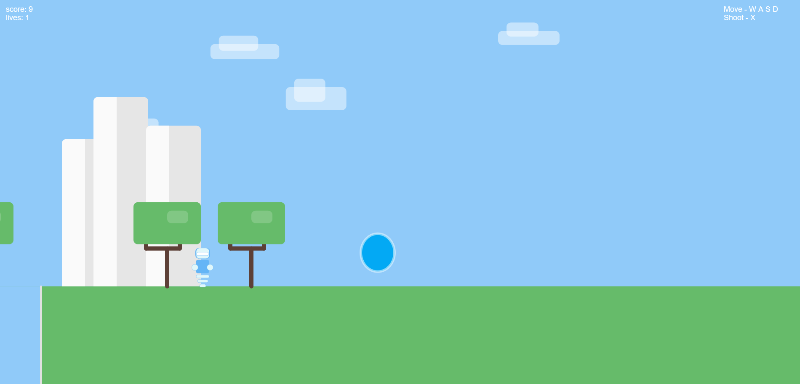

### Gameplay instructions

A, D - move
W - jump
X - shoot to deaciate drone

Collect points, deactivate drones and reach the portal to finish the level.
Be careful not to fall in the gaps.

### How to run

For VSCode:

-   install the Live Server extension
-   open the sketch.js file
-   run live server and open localhost in browser (ex. http://localhost:5500/)

Brackets

-   open project
-   click on live preview icon
-   game should open automatically in browser
